# 1장 사용자 수에 따른 규모 확장성

## 단일 서버

- 웹 앱, 데이터베이스, 캐시 등 전부 서버 한 대에서 실행

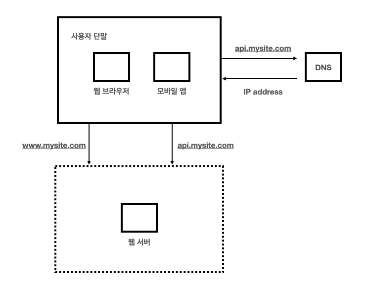

### 사용자 요청 흐름

1. 도메인 이름으로 웹사이트 접속, DNS에 질의하여 IP 주소 변환
2. 변환된 IP 주소로 HTTP 요청
3. 요청 받은 웹 서버는  HTML 페이지나 JSON 응답을 반환

#### 웹 서버 (Web Server)

- 정적인 컨텐츠(HTML, CSS, JavaScrip 파일 등)를 클라이언트에게 전달하는 역할
- 대표적인 에로 Apache, Nginx 등

#### 웹 애플리케이션 서버 (WAS, Web Application Server)

- 동적인 컨텐츠를 생성, 제공하는 역할
- 데이터베이스 조회나 다양한 로직 처리와 같은 동적인 작업 처리
- 대표적인 예로 Tomcat, JBoss, WildFly 등

## 데이터베이스

사용자가 늘면 하나의 서버로 허용할 수 있는 용량에 한계가 발생, 웹/모바일 트래픽 처리 서버와 데이터베이스 서버를 분리하여 독립적으로 확장한다.

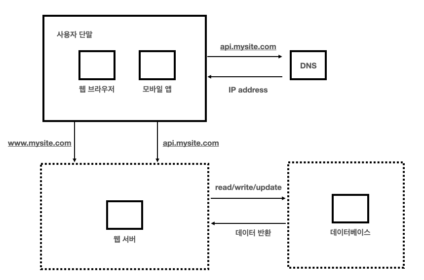

### 어떤 데이터베이스를 사용할 것인가?

#### 관계형 데이터베이스(RDBMS)

- 자료를 테이블과 열, 컬럼으로 표현한 데이터베이스
- 여러 테이블에 있는 데이터를 join 하여 조회
- 장점
    - 데이터 일관성 유지 용이
    - ACID(원자성, 일관성, 고립성, 지속성) 속성을 지원하여 데이터 무결성 보장
    - 복잡한 쿼리 수행에 적합
- 단점
    - 대량의 데이터에 대한 확장성 한계
    - 스키마 변경이 어렵고, 비용이 많이 들 수 있음

#### 비 관계형 데이터베이스(NoSQL)

- 스키마가 없거나 유연한 스키마를 가짐
- 키-값 저장소(key-value store), 그래프 저장소(graph store), 칼럼 저장소(column store), 문서 저장소(document store) 등 다양한 형태로 데이터 저장
- 장점
    - 대향의 분산된 데이터를 효율적으로 처리
    - 확장성 용이
    - 분산형 아키텍처를 활용하여 성능 최적화
    - 유연한 스키마를 통해 데이터 모델 쉽게 변경하고 적응 가능
- 단점
    - 데이터의 일관성을 보장하기 어려움
    - 복잡한 쿼리나 데이터 조인이 어렵거나 비효율적일 수 있음
    - 특정 작업에 따라 적합한 NoSQL 데이터베이스 유형을 선택해야 함

- key-value store : redis
- document store : mongodb
- graph store : neo4j
- column store : apache cassandra

## 수직적 규모 확장 VS 수평적 규모 확장

- 수직적 규모 확장
    - 스케일업(scale up), 고사양 자원을 추가하는 행위
    - 트래픽 양이 적을 때 수직적 확장이 좋음
    - 단점
        - 한 대의 서버에 CPU나 메모리를 무한대로 증설항 방법이 없음
        - 장애에 대한 자동 복구나 다중화가 안 됨
        - 따라서 대규모 애플리케이션 지원은 수평적 규모 확장이 적절
- 수평적 규모 확장
    - 스케일 아웃(scale out), 더 많은 서버 추가

### 로드밸런서

부하 분산 집합에 속한 웹 서버들에게 트래픽 부하를 고르게 분산하는 역할

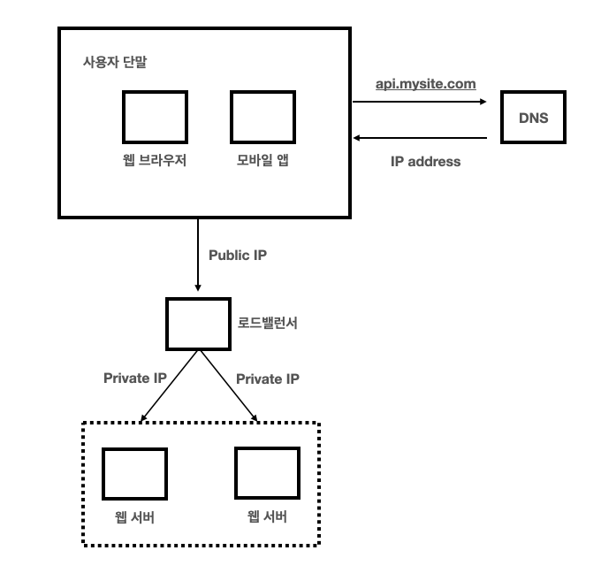

로드밸런서는 공개 IP 주소로 접속한다. 웹 서버 접속은 사설 IP 주소를 이용하는데, 같은 네트워크에 속한 서버 사이의 통신에만 쓰일 수 있는 IP 주소를 이용한다.

두 대의 서버 중 하나의 서버가 다운된다면 나머지 한 대의 서버로 트래픽이 전송되기에 전체 다운이 방지된다.  
웹 사이트에 유입되는 트래픽이 증가하면 현재의 서버로 감당할 수 없다면 새로운 서버를 추가하면서 로드밸런서가 자동적으로 트래픽 분산을 할 수 있다.

- 장점
    - 부하 분산
        - 여러 서버로 트래픽 분산
    - 고가용성
        - 한 대의 서버가 다운되더라도 다른 서버가 요청 처리
    - 확장성
        - 트래픽 분산을 위한 서버 추가 쉬움
    - 성능 향상
        - 최적의 서버를 선택하여 라우팅 하여 성능을 최적화 할 수 있음
- 단점
    - 단일 장애 지점
        - 로드밸런서 자체가 단일 장애 지점이 될 수 있음
    - 성능 오버헤드
        - 로드밸런서 자체에서 트래픽을 처리하는 오버헤드가 있을 수 있음
    - 관리 비용 증가

### 데이터베이스 다중화

트래픽이 증가하면 단일 장애 지점이 될 확률이 높은 곳은 데이터베이스이다. 이를 해결하기 위해 데이터베이스 다중화를 한다.  
보통 주(master)-부(slave) 관계를 설정하고, 원본 데이터는 주 서버에, 사본은 부 서버에 저장한다.

대부분의 애플리케이션은 읽기 연산의 비중이 높기 때문에 통산 부 데이터베이스의 수가 많다.

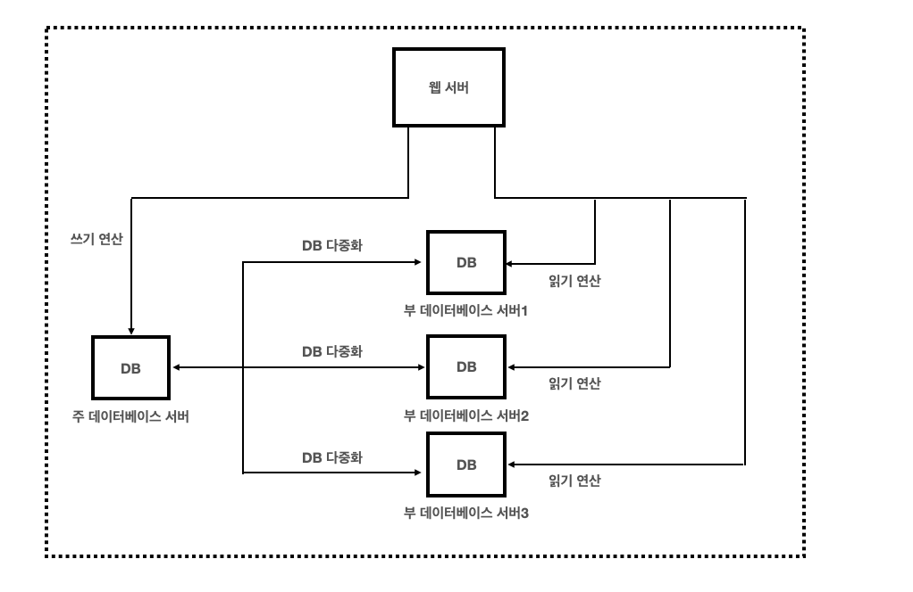

- 장점
    - 더 나은 성능 : 읽기 연산이 분산되어 병렬로 처리될 수 있는 query 수가 늘어나 성능이 좋아짐
    - 안정성(reliability) : 서버 일부가 망가져도 데이터 보존 가능
    - 가용성(availability) : 서버에 장애가 발생해도 다른 곳에서 데이터 제공 가능

#### 장애 상황별

- 부 서버가 한 대 뿐이고, 다운 된다면
    - 쓰기/읽기 연산 모두 주 서버로 전달되고, 새로운 부 서버가 대체할 것이다.
- 여러 부 서버 가운데 한 대의 부 서버가 다운 된다면
    - 읽기 연산은 나머지 부 서버로 분산되고, 새로운 부 서버가 대체될 것이다.
- 주 서버가 다운 된다면
    - 한 대의 부서버만 있다면, 한 대의 부 서버가 새로운 주 서버가 되고 쓰기/읽기 연산 모두를 수행한다.
    - 그리고 새로운 부 서버가 추가 될 것이다.

주 서버가 다운된다면 데이터가 최신 상태가 아닐 수 있는데 이는 `복구 스크립트(recovery scrip)`를 실행하여 최신 상태를 맞춰야 한다.

#### 로드밸런서와 데이터베이스 다중화 설계안

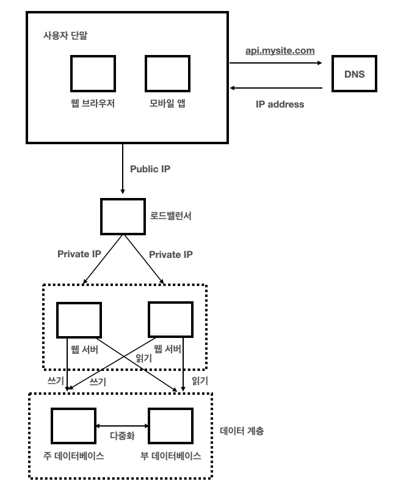

1. DNS로 부터 로드밸런서 공개 IP 획득
2. 로드밸런서 접속
3. HTTP 요청은 서버1 또는 서버2로 전달
4. 웹 서버는 사용자 데이터를 부 데이터베이스 서버에서 읽음
5. 데이터 업데이트 연산은 주 데이터베이스로 전달

## 캐시

값비싼 연산 결과 또는 자주 참조되는 데이터를 메모리 안에 두고, 요청이 보다 빨리 처리될 수 있도록 하는 저장소

- 연산이 오래 걸리거나 자주 참조 되는 데이터를 메모리에 적재
- 이후 메모리에서 참조
- 애플리케이션 성능은 데이터베이스를 얼마나 자주 호출하냐에 따라 죄우

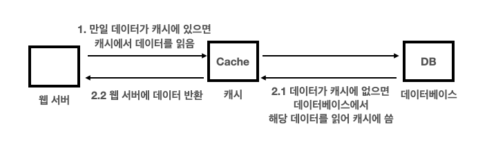

- 웹서버 - 데이터베이스 사이에 별도의 캐시 위치
- 캐시를 독립적 확장도 가능

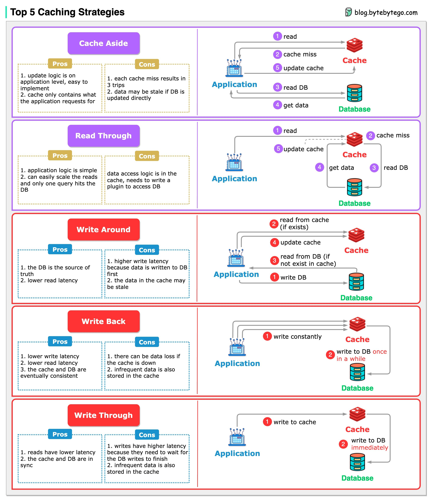

- Cache Aside
    - 일반적으로 사용되는 기본적인 캐시 전략
    - 캐시에 장애가 발생하더라도 데이터베이스 요청을 전달하므로 캐시 장애에 대비 가능
    - 캐시와 데이터베이스 간의 정합성 유지 문제가 발생할 수 있으며,
    - 초기 조회시 무조건 데이터베이스 호출해야 하므로 단건 호출 빈도가 높은 서비스에 적합하지 않음
    - 대신, 반복적으로 동일 쿼리를 수행하는 서비스에 적합

- Read Through
    - 캐시에서만 데이터를 읽어오는 전략
    - 데이터 조회를 전적으로 캐시에만 의지, 캐시가 다운되면 서비스 이용 차질 생김
    - 대신, 캐시와 데이터베이스간의 데이터 동기화가 항상 이루어짐

- Write Around
    - 모든 데이터는 데이터베이스에 저장 (캐시 갱신 X)
    - 캐시 미스가 발생하면 캐시에 데이터 저장
    - 따라서, 캐시와 데이터베이스 데어터 불일치가 발생 가능
    - 데이터베이스 데이터가 수정, 삭제 될 때마다 캐시 또한 변경해야 함
    - 또는 캐시 만료를 짧게 해야 함

- Write Back
    - 데이터를 저장할 때 데이터베이스에 바로 저장하지 않고, 캐시에 모아서 일정 주기 배치 작업으로 데이터베이스에 반영
    - 캐시에 모아 데이터베이스에 쓰기 때문에 쓰기 쿼리 회수 비용과 부하를 줄임
    - Write가 빈번하면서 Read를 하는데 많은 양의 Resource가 소모되는 서비스에 적합
    - 캐시에서 오류가 발생하면 데이터 영구 소실 가능

- Write Through
    - 데이터베이스와 캐시에 동시에 데이터를 저장하는 전략
    - 먼저 캐시에 데이터를 저장한 다음 바로 데이터베이스에 저장
    - 데이터베이스와 캐시가 항상 동기화 되어 있어, 캐시 데이터는 항상 최신
    - 데이터 유실이 발생하면 안 되는 상황에 적합
    - 매 요청마다 두 번의 Write가 발생해 성능 이슈 발생

#### 캐시 사용 시 유의사항
- 데이터 갱신은 드물지만 참조는 빈번한 경우 유리함
- 영속적인 데이터는 비추
- 만료정책에 대한 고민 필요
- 일관성 유지에 대한 고민 필요
- 캐시 자체가 단일 장애 지점이 될 가능성이 있음
- 캐시 메모리는 과할당이 유리
- 데이터 방출 정책 고려해야함

## 콘텐츠 전송 네트워크(CDN)

정적 콘텐츠를 전송하는데 쓰이며, 지리적으로 분산된 네트워크이다.  
이미지, 비디오, CSS, JavaScrip 파일 등을 캐시한다.

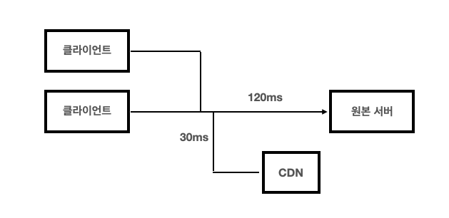

#### 동작 설명

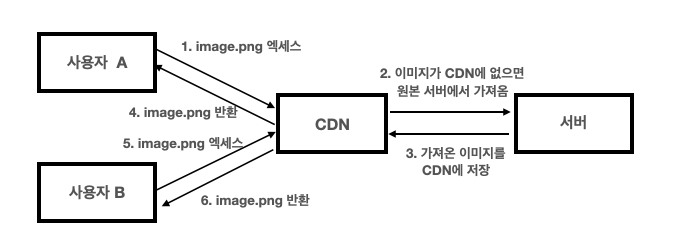

1. 사용자가 이미지 URL을 이용하여 접근
2. CDN 서버에 이미지가 없는 경우, 서버는 원본 서버에 요청
3. 원본 서버가 CDN에 반환, 응답 HTTP 헤더에는 TTL 값이 들어 있다
4. CDN 서버는 파일을 캐시하고 사용자에게 반환, TTL 시간만큼 캐시됨
5. 다른 사용자가 CDN 서버에 이미지 요청
6. 만료되지 않은 이미지는 캐시를 통해 반환

#### CDN 사용 시 고려해야 할 사항

- 비용
- 만료 시한 설정
- CDN 장애 대응 방안
- 콘텐츠 무효화 방법

## 무상태(stateless) 웹 계층

HTTP 같은 경우는 stateless 하기 때문에 세션 같은 정보는 저장 해야한다.  
상태 정보를 데이터베이스 같은 지속성 저장소에 보관하고, 필요할 때 가져오는게 좋다.

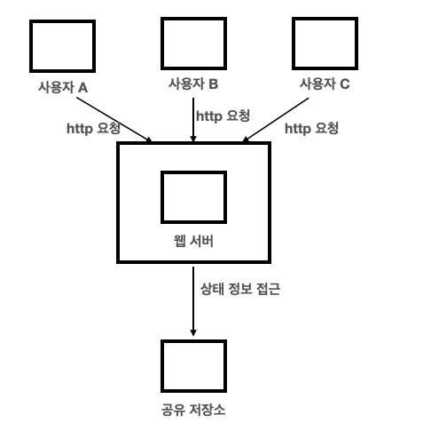

웹 서버는 상태 정보가 필요할 경우 공유 저장소에 데이터를 저장하고 가져온다.  
이런 구조는 단순하고, 안정적이며, 규모 확장이 쉽다.

## 데이터 센터

가용성을 높이고 어느 지역에서나 쾨적한 환경 제공

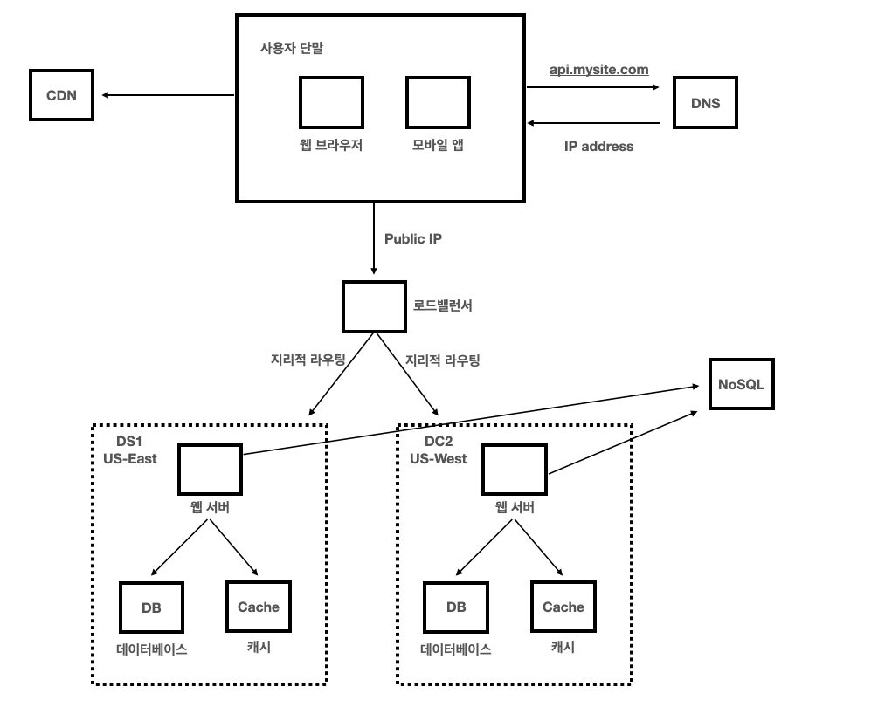

#### 기술적 난제

- 트래픽 우회 : 올바른 데이터 센터로 트래픽을 보내는 효과적인 방법을 찾아야 한다.
- 데이터 동기화 : 데이터를 여러 데이터 센터에 다중화
- 테스트와 배포 : 애플리케이션을 여러 위치에서 테스트 하고, 자동화된 배포 도구는 모든 데이터 센터에 동일한 서비스가 설치되도록 하는 것이 중요

## 메시지 큐

- 무손실를 보장하는 비동기 통신을 지원하는 컴포넌트
- 생산자 또는 발행자라 불리는 입력 서비스가 메시지를 생성하여 큐에 발행
- 큐에는 소비자 혹은 구독자가 메시지를 받아 동작 수행

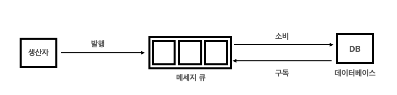

메시지 큐를 이용하면 서비스 또는 서버 간 결합이 느슨해져서, 규모 확장성이 보장되어야 하는 안정적 애플리케이션을 구성하기 좋다.

## 로그, 메트릭 그리고 자동화

사업 규모가 커지면 로그나 메트릭, 자동화 같은 작업이 필수적 이다.

#### 로그

- 시스템의 오류와 문제들을 보다 쉽게 찾을수 있게 한다.

#### 메트릭

- 호스트 단위 메트릭 : CPU, 메모리, 디스크 I/O
- 종합 메트릭 : 데이터베이스 계층 성능, 캐시 계층 성능 등
- 핵심 비즈니스 메트릭 : 일별 능동 사용자, 수익, 재방문 등

#### 자동화

- 시스템이 크고 복잡해지면 생선성을 높이기 위해 자동화 도구 적극 활용 해야함
- CI/CD를 통해 지속적 통합, 빌드, 테스트, 배포 등을 자동화 할 수 있음

### 메시지 큐, 로그, 메트릭, 자동화 등을 반영한 수정 설계안

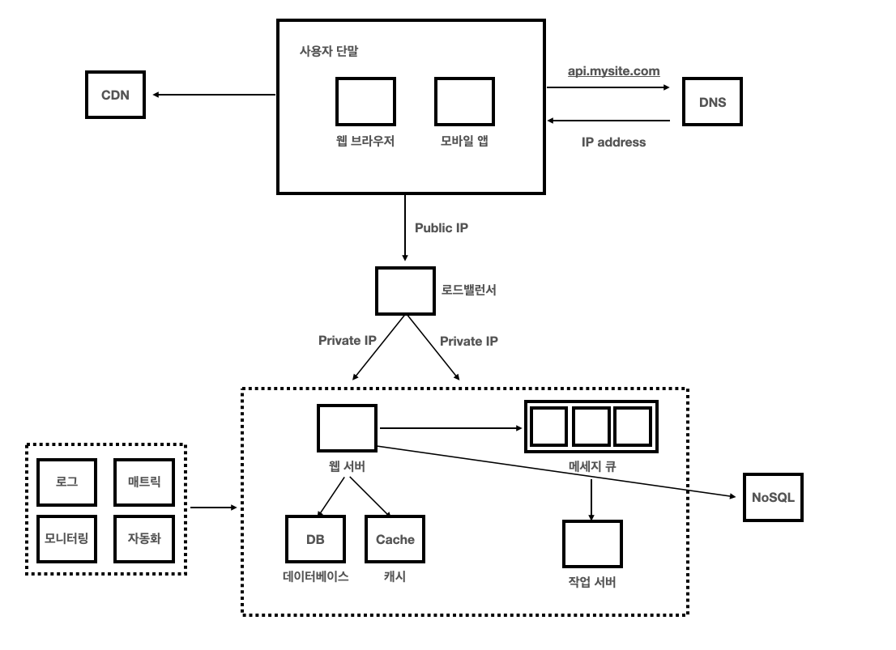

## 데이터베이스의 규모 확장

데이터가 많아지면 데이터베이스에 부하가 증가한다. 이를 해결하기 위해 두 가지 접근법이 있다.
- 수직적 확장
- 수평적 확장

### 수직적 확장

고성능의 자원(CPU, RAM, 디스트 등)을 증설하는 방법

- 단점
  - 하드웨어에 한계가 있으므로 무한 증설 불가능
  - SPOF로 인한 위험성 증가
  - 고성능 서버는 가격이 비쌈

### 수평적 확장

수평적 확장은 샤딩(sharding)이라고도 한다.  
서버를 추가함으로써 성능을 향상한다.  
샤딩은 대규모 데이터베이스를 샤드라고 부르는 작은 단위로 분할하는 기술이다.  
모든 샤드는 같은 스키마, 샤드 간 중복 데이터는 없다.

샤딩 전략을 구현할 때 고려해야 할 가장 중요한 것은 샤딩 키(파티션 키) 이다.  
데이터가 어떻게 분산될지 정하는 하나 이상의 컬럼으로 구성된다.  
샤딩 키를 정할 때 데이터를 고르게 분할 할 수 있도록 하는게 중요하다.

#### 샤딩에 따르는 이슈

- 데이터의 재 샤딩
  - 데이터가 많아져 하나의 샤드로 감당이 어려울 때
  - 데이터 분포가 균등하지 못하여 샤드에 할당된 공간 소모가 빠르게 진행될 때
- 유명인사 문제
  - 핫스팟 키 문제라고도 한다
  - 특정 샤드에 질의가 집중되어 서버에 과부하가 걸리는 문제
- 조인과 비정규화
  - 여러 샤드에 걸치 데이터 조인이 힘들다

#### 최종 시스템 설계안

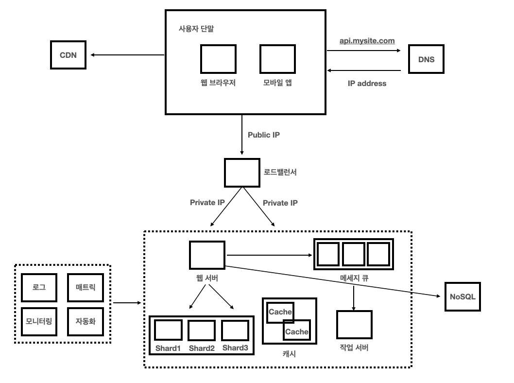

## 마지막으로

- 웹 계층은 무상태 계층으로
- 모든 계층에 다중화 도입
- 가능한 한 많은 데이터를 캐시할 것
- 여러 데이터 센터를 지원할 것
- 정적 콘텐츠는 CDN을 통해 서비스할 것
- 데이터 계층은 샤딩을 통해 그 규모를 확장할 것
- 각 계층은 독립적 서비스로 분할할 것
- 시스템을 지속적으로 모니터링하고, 자동화 도구들을 활용할 것

### 참고 문헌

- https://devocean.sk.com/community/detail.do?ID=165936
- https://velog.io/@bbkyoo/%EA%B0%80%EC%83%81-%EB%A9%B4%EC%A0%91-%EC%82%AC%EB%A1%80%EB%A1%9C-%EB%B0%B0%EC%9A%B0%EB%8A%94-%EB%8C%80%EA%B7%9C%EB%AA%A8-%EC%8B%9C%EC%8A%A4%ED%85%9C-%EC%84%A4%EA%B3%84-%EA%B8%B0%EC%B4%88-1%EC%9E%A5-%EC%82%AC%EC%9A%A9%EC%9E%90-%EC%88%98%EC%97%90-%EB%94%B0%EB%A5%B8-%EA%B7%9C%EB%AA%A8-%ED%99%95%EC%9E%A5%EC%84%B1
